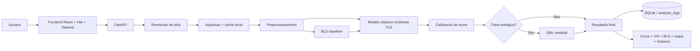

# ExoQML

ExoQML e uma plataforma de triagem de transitos exoplanetarios com frontend web, pipeline cientifico em Python, baseline classico por BLS, modelo profundo multiview em nivel de TCE e segunda etapa QML residual para casos ambiguos.


## Resumo executivo

O projeto foi construido para responder a um problema objetivo: tornar a analise de curvas de luz astronomicas acessivel em uma interface unica, sem esconder a parte cientifica nem depender de uma stack de laboratorio fora de contexto de produto.

O fluxo entregue hoje faz:

- busca de alvo por `TIC`, `KIC` ou nome
- aquisicao da curva de luz a partir de fontes publicas
- preprocessamento reproducivel
- baseline classico via BLS
- inferencia com modelo profundo calibrado
- XAI temporal projetada de volta para a curva
- revisao opcional por QML residual
- persistencia do historico em banco local
- exportacao em `JSON` e `CSV`
- interface web em producao local com catalogo de alvos, mapa, historico e resultados

## Destaques tecnicos

- Dataset principal de treino: `15.737` TCEs de `9.865` estrelas
- Distribuicao: `3.600` TCEs positivos e `12.137` negativos
- Tamanho local do dataset: `64,84 GB`
- Modelo principal: `TransitMultiViewNet` em nivel de TCE
- Melhor resultado classico calibrado: `F1 0.8275`, `PR-AUC 0.8068`, `ROC-AUC 0.9563`
- Melhor variante QML residual tunada: `F1 0.8385`, `PR-AUC 0.8082`, `ROC-AUC 0.9569`
- Benchmark operacional quente em CPU: `0,8179 s`
- Banco de dados da aplicacao: `SQLite` via `SQLAlchemy`

## Por que este projeto existe

A maior parte dos exemplos de exoplanetas para leigos ou fica superficial demais, ou fica presa ao laboratorio. O objetivo aqui foi entregar os dois lados ao mesmo tempo:

1. produto utilizavel
2. pipeline cientifico rastreavel
3. comparativo classico vs IA
4. caminho experimental de QML com criterio tecnico real

## Arquitetura



## Evolucao dos modelos

| Etapa | Formulacao | Resultado principal |
|---|---|---:|
| Baseline inicial | Classificacao por estrela com curva inteira | `F1 0.5011` / `PR-AUC 0.3915` |
| Multiview TCE | Views phase-folded global/local + features escalares | `F1 0.8275` / `PR-AUC 0.8068` |
| QML residual tunado | Correcao residual apenas em casos ambiguos | `F1 0.8385` / `PR-AUC 0.8082` |

## Dataset usado

### Origem

- `MAST/STScI` via `lightkurve` para aquisicao online
- catalogo local de treino baseado em `Kepler` DR24 TCE
- inferencia online tambem suporta `TESS`

### Volume e distribuicao

- `15.737` TCEs totais
- `3.600` TCEs positivos
- `12.137` TCEs negativos
- `9.865` estrelas totais
- `2.716` estrelas com pelo menos um `PC`
- `7.149` estrelas negativas
- split por estrela para evitar leakage:
  - treino: `12.558` TCEs
  - validacao: `1.588` TCEs
  - teste: `1.591` TCEs

### Por que saimos de estrela para TCE

A formulacao por estrela colapsava multiplos eventos de uma mesma estrela em um unico rotulo binario. Isso gerava ruido supervisionado. A mudanca para nivel de TCE foi decisiva porque preserva ephemeris, duracao, profundidade e contexto do evento.

## Features e por que elas foram escolhidas

### Views temporais

- `global_view`: `401` bins
- `local_view`: `121` bins

Essas duas visoes foram escolhidas porque resolvem problemas diferentes:

- a view global preserva contexto orbital mais amplo e ajuda a ver repeticao, assimetria e estrutura geral
- a view local foca a morfologia do transito e ajuda a diferenciar quedas reais de ruido e artefatos

### Features escalares

- `period`
- `duration`
- `depth`
- `model_snr`

Essas features entram normalizadas via `log1p` porque carregam conhecimento de dominio forte e ajudam a rede a nao reaprender do zero relacoes fisicas simples que o catalogo ja fornece.

### Baseline cientifico

O `BLS` foi mantido porque:

- e interpretavel para o dominio
- fornece um comparativo classico direto
- ajuda a estimar `period`, `depth` e contexto de evento
- funciona como verificacao externa do score da IA

## Modelos utilizados

### 1. Modelo classico de producao

Arquivo principal: `backend/exoqml/training/model.py`

Arquitetura usada em producao:

- dois encoders `1D` residuais independentes para view global e local
- bloco denso para features escalares
- fusao das tres representacoes
- cabeca final binaria calibrada

Razoes para essa escolha:

- convolucao `1D` residual funciona bem em sinais seriados com padroes locais
- duas views resolvem melhor transitos do que uma curva inteira unica
- fusao tardia permite combinar forma temporal e contexto escalar
- arquitetura continua leve o suficiente para inferencia local rapida

### 2. QML hibrido e QML residual

O QML completo inicial nao superou o classico de forma consistente. A versao que passou a agregar valor foi a residual:

- o modelo classico continua sendo o caminho principal
- o QML aprende apenas um `delta` no logit classico
- esse delta so roda na faixa ambigua `[0.35, 0.65]`

Esse desenho foi escolhido porque o QML puro nao justificava substituir o backbone inteiro no ambiente atual. Como revisor especializado de casos ambiguos, ele passou a melhorar o classico com custo controlado.

## Resultados principais

### Modelo principal classico calibrado

| Metrica | Valor |
|---|---:|
| Accuracy | `0.9164` |
| Precision | `0.7995` |
| Recall | `0.8575` |
| F1 | `0.8275` |
| ROC-AUC | `0.9563` |
| PR-AUC | `0.8068` |

### Calibracao de score

O score final de producao foi calibrado com `Platt scaling`.

| Metrica de calibracao | Antes | Depois |
|---|---:|---:|
| Brier | `0.0950` | `0.0666` |
| ECE | `0.1289` | `0.0209` |

### QML residual tunado

| Metrica | Valor |
|---|---:|
| Precision | `0.7845` |
| Recall | `0.9005` |
| F1 | `0.8385` |
| ROC-AUC | `0.9569` |
| PR-AUC | `0.8082` |

## Benchmark operacional

| Cenario | Mediana total |
|---|---:|
| `compute_only` | `0.7418 s` |
| `warm_full_pipeline` | `0.8179 s` |
| `cold_full_pipeline` | `30.6404 s` |

Leitura tecnica:

- o pipeline local atende com margem quando os dados ja estao acessiveis
- o gargalo remanescente do MVP e aquisicao fria remota
- o gargalo nao esta no modelo nem na interface

## Banco de dados utilizado

A aplicacao usa `SQLite` via `SQLAlchemy` para o historico operacional.

Tabela principal: `analysis_logs`

Campos relevantes:

- `target_id`
- `target_type`
- `mission`
- `data_source`
- `model_name`
- `model_version`
- `prediction_label`
- `prediction_score`
- `bls_period`
- `status`
- `payload_json`
- `created_at`

Motivo da escolha:

- zero-overhead para MVP local
- suficiente para historico, reabertura e export
- evita dependencia de infra externa na fase inicial do produto

## Plataforma web

### Home atual


### Resultado da analise


### Layout mobile


### O que a plataforma entrega para o usuario

- input com lista real de alvos do catalogo local
- explorador completo com filtros de missao e tipo de alvo
- mapa simplificado com referencias e alvo analisado
- score, curva, XAI, BLS, historico e export na mesma tela
- demonstracao pratica dos modelos em producao, nao apenas texto descritivo

## Stack da plataforma

### Backend

- Python `3.11`
- FastAPI
- SQLAlchemy
- NumPy
- lightkurve
- PyTorch
- PennyLane

### Frontend

- React `19`
- Vite
- Tailwind CSS `v4`
- Lucide icons

## Treino e reproducao

O pipeline de treino inclui:

- ingestao com cache em disco
- checkpoint `latest` e `best`
- retomada automatica apos interrupcao
- ajuste de uso de CPU, RAM, disco e GPU
- cache de views folded
- experimentos de `hard-negative mining`
- calibracao posterior do score

## Estrutura do repositorio

```text
backend/        API, inferencia, banco, pipeline cientifico
frontend/       interface React + Tailwind
scripts/        benchmark, treino, calibracao, QML
docs/           documentacao tecnica e imagens do projeto
prd_exoqml.md   documento base do produto
```

## Como rodar localmente

### Backend

```powershell
cd backend
uv venv --python 3.11 .venv
.\.venv\Scripts\python -m pip install -e .[dev]
.\.venv\Scripts\python -m pip install -e .[science]
.\.venv\Scripts\uvicorn exoqml.main:app --reload --port 8000
```

### Frontend

```powershell
cd frontend
npm install
npm run dev
```

## Documentacao complementar

- Relatorio tecnico completo: [docs/TECHNICAL_REPORT.md](docs/TECHNICAL_REPORT.md)
- Avaliacao offline: [backend/docs/OFFLINE_EVALUATION.md](backend/docs/OFFLINE_EVALUATION.md)
- Benchmark operacional: [backend/docs/OPERATIONS_BENCHMARK.md](backend/docs/OPERATIONS_BENCHMARK.md)
- Trilhas QML: [backend/docs/QML_EXPERIMENT.md](backend/docs/QML_EXPERIMENT.md)
- Fechamento do PRD: [PRD_CLOSURE_PLAN.md](PRD_CLOSURE_PLAN.md)

## Estado atual do projeto

O projeto esta em um ponto raro: ele nao e apenas um prototipo visual nem apenas um notebook experimental. Hoje ele ja combina:

- produto web funcional
- pipeline cientifico rastreavel
- benchmark real
- banco de historico
- modelos treinados e comparados
- variante QML que agrega valor de forma objetiva


