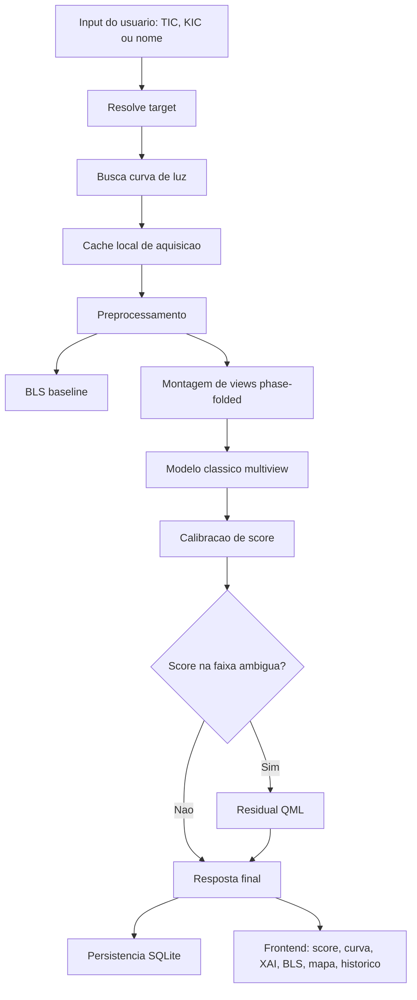
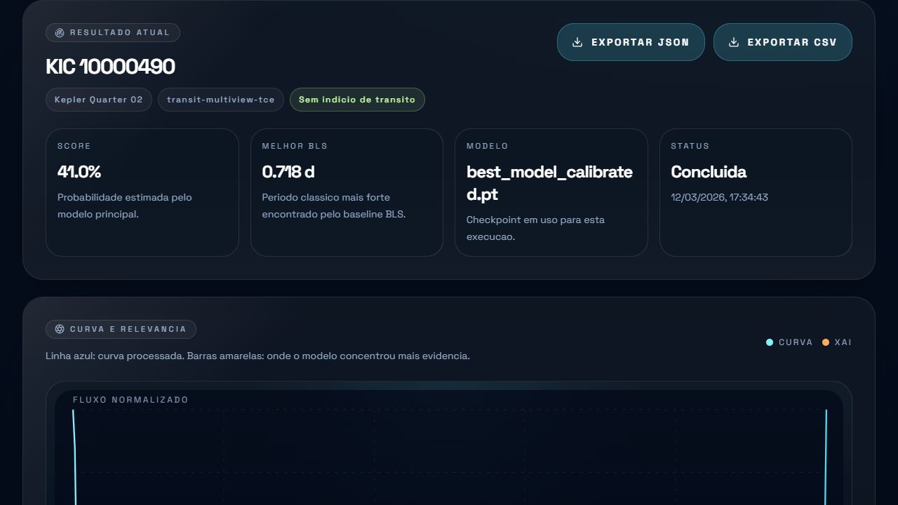
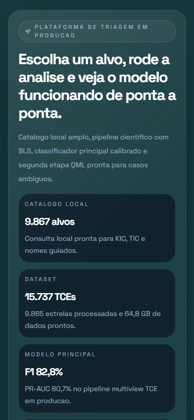

# Relatorio Tecnico do ExoQML

## 1. Objetivo

Este documento registra tecnicamente o que foi construido no ExoQML, como o sistema foi evoluindo ao longo da implementacao e quais decisoes de engenharia e modelagem levaram ao estado atual do projeto.

O objetivo do sistema nao e confirmar exoplanetas. O objetivo e fazer triagem assistida de curvas de luz, combinando:

- baseline astronomico classico
- modelo profundo com features de dominio
- explicabilidade temporal
- historico persistido
- interface web utilizavel por pessoas que nao trabalham diariamente com catalogos astronomicos
- trilha QML experimental com criterio quantitativo real

## 2. Escopo entregue

O que foi entregue no repositorio:

- frontend React + Vite + Tailwind focado em uso pratico
- backend FastAPI com endpoints de saude, catalogo, analise, historico e export
- aquisicao de curvas de luz via `lightkurve` com cache local
- preprocessamento reproduzivel da serie temporal
- baseline `BLS` para comparativo classico
- modelo profundo multiview em nivel de `TCE`
- calibracao do score por `Platt scaling`
- XAI temporal projetada de volta no eixo do tempo
- banco `SQLite` para historico operacional
- benchmark operacional do pipeline
- experimento `PennyLane` com cabeca hibrida e depois residual `QML`

## 3. Visao de arquitetura

## 4. Fontes de dados e dataset

### 4.1 Fontes online

No fluxo online da plataforma, a aquisicao usa principalmente:

- `MAST/STScI` via `lightkurve`
- `TESScut` como fallback para alguns alvos `TESS`

Essas fontes entram na rota de analise e permitem que o usuario rode o sistema para um alvo real a partir da interface.

### 4.2 Dataset offline de treino

O treinamento principal foi construido sobre um catalogo local baseado em `Kepler` DR24 TCE.

Estatisticas consolidadas do melhor run classico:

- total de `TCEs`: `15.737`
- positivos: `3.600`
- negativos: `12.137`
- estrelas totais: `9.865`
- estrelas positivas: `2.716`
- estrelas negativas: `7.149`
- tamanho em disco: `64,84 GB`

Split por estrela:

- treino: `12.558` TCEs
- validacao: `1.588` TCEs
- teste: `1.591` TCEs

### 4.3 Por que o split foi por estrela

Esse ponto foi crucial. No comeco, o problema estava formulado como classificacao binaria por estrela. Isso era mais simples de implementar, mas introduzia ruido de rotulo quando uma mesma estrela tinha multiplos TCEs com comportamentos diferentes.

A mudanca para `split por estrela` e `rotulo por TCE` resolveu dois problemas de uma vez:

1. evita leakage entre treino e teste
2. preserva o evento observacional como unidade fisica da classificacao

## 5. Preprocessamento

Arquivo principal: `backend/exoqml/services/preprocess.py`

O preprocessamento atual faz:

1. remocao de `NaN`
2. remocao de outliers por `MAD` com corte em `6 sigma`
3. ordenacao temporal
4. normalizacao por mediana
5. detrending por `moving average`
6. clipping do fluxo flattenado para faixa controlada
7. resize/interpolacao para tamanho maximo configurado

### 5.1 Por que esse preprocessamento

As decisoes foram pragmatica e cientificamente orientadas:

- mediana e robusta a outliers
- `MAD` e mais estavel do que desvio padrao puro para curvas ruidosas
- `moving average` resolve um baseline simples sem exigir dependencia mais pesada na etapa online
- clipping evita explodir a dinamica numerica da rede por artefatos raros
- resize fixa custo e latencia para inferencia local

## 6. Engenharia de features

Arquivo principal: `backend/exoqml/transit_features.py`

### 6.1 Phase folding

O pipeline estima epoca e gera `phase folding` do evento. Isso permite alinhar diferentes ocorrencias do mesmo sinal periodico em um eixo comum e foi a base da virada de desempenho do projeto.

### 6.2 Views usadas

- `global_view`: `401` bins
- `local_view`: `121` bins

A view global captura contexto orbital maior. A local foca a forma do evento perto do transito.

### 6.3 Features escalares

O modelo recebe tambem:

- `period`
- `duration_hours`
- `depth_ppm`
- `model_snr`

Essas features sao transformadas com `log1p` e normalizadas para faixa util.

### 6.4 Por que essas features

O raciocinio foi:

- `period` ajuda a contextualizar repeticao do evento
- `duration` ajuda a separar dips curtos e largos
- `depth` leva a intensidade do sinal para o modelo sem obrigar a rede a inferir tudo apenas da forma folded
- `SNR` adiciona informacao de confianca do evento

Em outras palavras: as views carregam morfologia; as features escalares carregam contexto de dominio.

## 7. Evolucao dos modelos

### 7.1 Baseline inicial: classificacao por estrela

A primeira versao tratava a estrela como unidade de decisao e usava uma representacao muito mais pobre da serie temporal.

Resultado:

- `F1 = 0.5011`
- `PR-AUC = 0.3915`

Esse baseline serviu para mostrar rapidamente que o pipeline funcionava ponta a ponta, mas deixou claro que a formulacao estava subutilizando o dataset.

### 7.2 Modelo classico principal: TransitMultiViewNet

Arquivo principal: `backend/exoqml/training/model.py`

Arquitetura:

- encoder `1D` residual para view global
- encoder `1D` residual para view local
- bloco denso para features escalares
- fusao tardia de todos os vetores
- cabeca final binaria

Motivos da escolha:

- convolucao `1D` residual funciona bem para padroes locais e repetitivos em series temporais
- duas views representam melhor o evento do que uma curva crua inteira
- fusao tardia permite independencia parcial entre forma temporal e contexto escalar
- modelo continua pequeno o suficiente para uso local rapido

Resultado do checkpoint campeao `20260311_053035`:

- Accuracy: `0.9164`
- Precision: `0.7995`
- Recall: `0.8575`
- F1: `0.8275`
- ROC-AUC: `0.9563`
- PR-AUC: `0.8068`

### 7.3 Hard-negative mining

Foi implementado um passo com `hard-negative mining` usando `WeightedRandomSampler` e negativos dificeis selecionados pelos scores do proprio modelo.

Aprendizado tecnico:

- melhorou recall em alguns runs
- nao superou o melhor checkpoint geral em `F1`
- foi util como experimento, mas nao se tornou o caminho principal

### 7.4 Calibracao do score

Depois do modelo campeao, foi aplicada calibracao `Platt scaling` no split de validacao.

Objetivo:

- manter ranking e separacao
- melhorar confianca probabilistica do score final

Resultados no teste:

- Brier: `0.0950 -> 0.0666`
- ECE: `0.1289 -> 0.0209`
- F1 permaneceu praticamente preservado

Essa etapa foi importante porque um produto nao precisa apenas classificar bem; ele precisa devolver um score interpretavel de maneira consistente.

## 8. Trilha QML

### 8.1 QML hibrido inicial

Foi implementada uma cabeca hibrida real com `PennyLane`.

Configuracao principal:

- `4 qubits`
- `2` camadas quanticas
- device `default.qubit`

A primeira versao QML funcionou, mas nao superou o classico de maneira pratica. Isso levou a uma mudanca de estrategia.

### 8.2 QML residual

A ideia correta nao foi substituir o classico. Foi usar o QML como corretor de casos ambiguos.

Desenho final:

- o backbone classico gera o score principal
- um gate verifica se o score caiu na faixa ambigua
- so nesses casos o residual QML corrige o logit classico

Melhor configuracao encontrada:

- faixa ambigua: `[0.35, 0.65]`
- `residual_alpha_init = 0.15`

### 8.3 Resultado do QML residual tunado

Leitura principal no teste:

- Precision: `0.7845`
- Recall: `0.9005`
- F1: `0.8385`
- ROC-AUC: `0.9569`
- PR-AUC: `0.8082`

Conclusao tecnica:

- o QML puro nao justificou substituir o classico
- o QML residual passou a agregar valor quando usado como segunda etapa especializada
- o ganho foi pequeno, mas real e mensuravel

### 8.4 Latencia do caminho QML

- classico direto: `0.1863 s`
- QML direto: `0.2132 s`
- caminho residual completo: `0.4437 s`

Como o gate so roda em casos ambiguos, o custo operacional continua controlado.

## 9. Inferencia e XAI

Arquivo principal: `backend/exoqml/services/inference.py`

A inferencia atual faz:

1. estima parametros de evento a partir da curva e do BLS
2. monta views folded e features escalares
3. roda o modelo classico calibrado
4. opcionalmente aciona o QML residual
5. gera mapa temporal de relevancia
6. projeta a atribuicao de volta para o eixo do tempo observado

### 9.1 Por que a XAI foi redesenhada

A versao inicial era insuficiente do ponto de vista cientifico. O melhor modelo passou a usar atribuicao gradiente-based nas views multiview e projecao de volta para a curva temporal.

Isso importa porque o usuario nao quer apenas um score; ele quer ver onde o modelo concentrou evidencia.

## 10. Baseline BLS

Arquivo principal: `backend/exoqml/services/bls.py`

Mesmo com a IA forte, o `BLS` foi mantido porque:

- e referencia classica conhecida no dominio
- ajuda a conferir consistencia do evento
- expande o poder explicativo da interface
- fornece um contraste importante entre metodo classico e metodo aprendido

Na plataforma, o `BLS` aparece lado a lado com o score do modelo, nunca escondido.

## 11. Banco de dados e persistencia

Arquivo principal: `backend/exoqml/models.py`

A plataforma usa `SQLite` para o historico operacional.

Tabela principal: `analysis_logs`

Campos persistidos:

- alvo e tipo de identificador
- missao e fonte de dados
- modelo e checkpoint usados
- score e rotulo previstos
- melhor periodo BLS
- status da analise
- payload completo serializado em JSON
- timestamp

### 11.1 Por que SQLite

Para o objetivo do MVP local, `SQLite` foi a escolha correta porque:

- reduz custo de operacao
- simplifica setup
- atende historico e export de forma suficiente
- facilita distribuicao local e demonstracoes

## 12. Plataforma web

### 12.1 Frontend

Stack:

- React `19`
- Vite
- Tailwind CSS `v4`
- Lucide icons

Decisao de UX:

A interface foi redesenhada para leigos e curiosos, com foco em acao e nao em texto longo. O usuario principal nao precisa saber um `TIC` ou `KIC` de memoria.

### 12.2 O que a home faz hoje

- mostra os modelos ativos em producao
- aceita busca por `nome`, `TIC` e `KIC`
- expande um catalogo local com milhares de alvos
- permite filtrar por missao e por status de candidato
- mostra mapa simplificado com referencias do ceu
- exibe historico reaberto sem sair da mesma tela

### 12.3 Screenshots atuais

#### Home

#### Resultado

#### Mobile

## 13. API e servicos do backend

Principais rotas:

- `GET /api/v1/health`
- `GET /api/v1/targets/catalog`
- `POST /api/v1/analyze`
- `GET /api/v1/history`
- `GET /api/v1/history/{id}`
- `GET /api/v1/history/{id}/export?format=json|csv`

Servicos principais:

- `identifier`: resolve o alvo
- `acquisition`: busca curva e usa cache local
- `preprocess`: limpa e padroniza a serie
- `bls`: calcula baseline classico
- `inference`: roda classico, calibracao e QML
- `analysis`: coordena ponta a ponta e grava historico
- `target_catalog`: fornece catalogo local navegavel ao frontend

## 14. Benchmark operacional

Benchmark validado em CPU para `KIC 10000490`:

| Cenario | Total | Aquisicao | Preprocess | BLS | Inferencia |
|---|---:|---:|---:|---:|---:|
| compute_only | `0.7418 s` | `0.0000 s` | `0.0239 s` | `0.5865 s` | `0.1292 s` |
| warm_full_pipeline | `0.8179 s` | `0.0108 s` | `0.0207 s` | `0.6441 s` | `0.1394 s` |
| cold_full_pipeline | `30.6404 s` | `29.9118 s` | `0.0184 s` | `0.5843 s` | `0.1260 s` |

### 14.1 Interpretacao

O gargalo do produto nao esta no modelo. Ele esta na primeira aquisicao remota. Isso muda completamente a leitura de risco tecnico: o problema residual nao e IA; e dependencia de fonte externa.

## 15. Resiliencia operacional

Foram implementados tambem:

- cache local de curvas de luz por alvo
- cache de views folded para treino
- checkpoints `latest` e `best`
- retomada automatica apos interrupcao no treino
- logging estruturado
- erros estruturados por etapa do pipeline
- carregamento seguro de checkpoints com `weights_only=True`

## 16. Principais aprendizados de engenharia

1. A maior melhora nao veio de mais epocas ou mais GPU. Veio de reformular corretamente o problema em nivel de `TCE`.
2. `Phase folding` com views global/local foi a decisao mais importante do projeto.
3. Features escalares de dominio evitaram desperdicar capacidade do modelo reaprendendo heuristicas basicas.
4. Calibracao foi essencial para transformar um classificador forte em um score utilizavel em produto.
5. QML so passou a fazer sentido quando deixou de ser caminho alternativo e virou corretor residual especializado.
6. UX e parte do problema tecnico: o sistema so fica bom para leigos quando a interface revela a stack de forma pratica, nao por blocos de texto longos.

## 17. Limitacoes atuais

- treino principal ainda concentrado em `Kepler`
- aquisicao fria continua lenta por dependencia externa
- a trilha QML ainda usa simulador e nao hardware quantico real
- `SQLite` atende o MVP, mas nao substitui um banco servidor em ambiente multiusuario
- o fallback de catalogo no frontend ainda gera um chunk grande no build, apesar de funcionar corretamente

## 18. Proximos passos naturais

- ampliar avaliacao por missao, especialmente `TESS`
- otimizar o fallback grande do catalogo no frontend
- adicionar politicas mais agressivas de pre-cache para aquisicao fria
- expandir o conjunto de features diagnosticas do evento
- continuar experimentos QML em configuracoes mais fortes ou com hardware diferente

## 19. Conclusao

O ExoQML terminou em um ponto tecnicamente consistente.

Nao ficou um projeto preso em jupyter notebook, e tambem nao virou apenas uma interface bonita desconectada da parte cientifica. Hoje ele entrega:

- modelo classico competitivo
- score calibrado
- comparativo BLS
- segunda etapa QML com ganho real
- plataforma web utilizavel
- banco de historico
- benchmark operacional
- documentacao suficiente para publicacao profissional em GitHub

Esse equilibrio entre produto, ciencia e experimento e o principal resultado do projeto.

